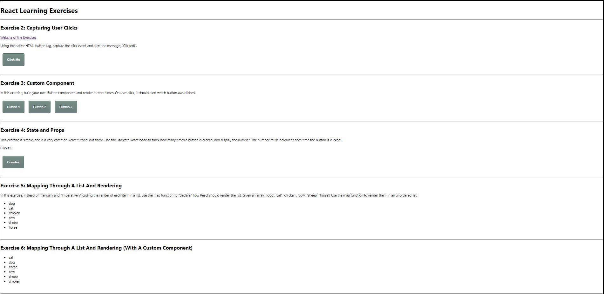

# React-Exercises-9
Simple 9 React Exercises to practice the concepts

Found the following Exercises online to practice the concepts of React: https://coderfiles.dev/blog/reactjs-coding-exercises/

Exercise Layout can befound here: 
- still need to finish Exercise 7-9

